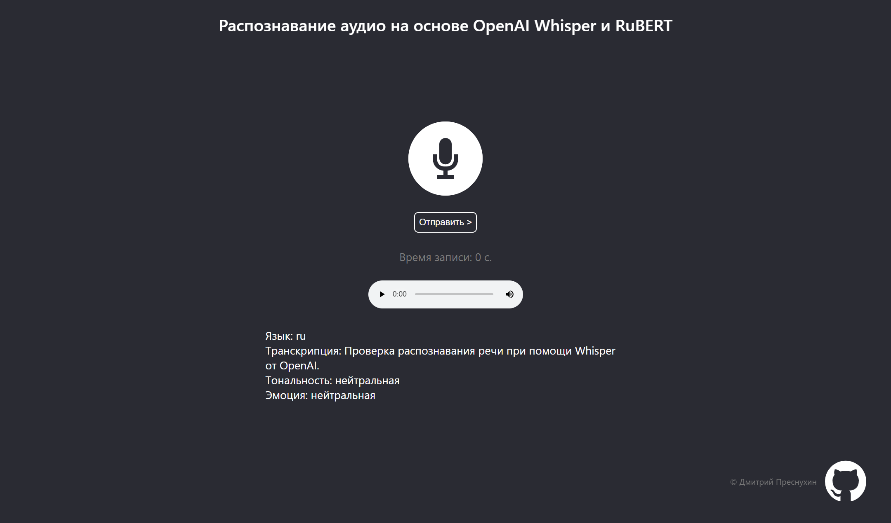

# Описание
Небольшое веб-приложение, позволяющее записать аудио прямо в браузере и получить его транскрипцию, эмоцию голоса и тональность распознанного текста. Выполнена в качестве проекта по дисциплине Обработка текстов на естественном языке (Natural Language Processing).

# Запуск
## Вариант 1 - используя docker
1. В папке с проектом прописываем
```bash
docker build -t speech-recognition:latest .
docker run -p 5000:5000 speech-recognition:latest
```
2. В консоли отобразится локальный адрес, по которому будет доступен сервер
## Вариант 2
1. Запустить `flask-server/main.py`
2. Перейти по адресу [http://127.0.0.1:8050](http://127.0.0.1:8050) (по умолчанию).
## Вариант 3 
1. Запустить `flask-server/main.py`
2. В файле App.jsx прописать в константе `SERVER_ADDRESS` путь к серверу flask (например http://127.0.0.1:8050)
3. Перейти в директорию .\front\
4. Установить зависимости и запустить дев-сервер React 
```bash
npm install
npm run start
```

# Демонстрация
